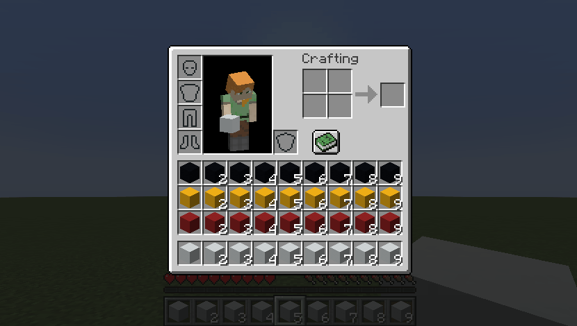

# Shifty Hotbar

[](https://github.com/Kir-Antipov/shifty-hotbar/actions/workflows/build-artifacts.yml)
[](https://github.com/Kir-Antipov/shifty-hotbar/releases/latest)
[](https://modrinth.com/mod/shifty-hotbar)
[](https://www.curseforge.com/minecraft/mc-mods/shifty-hotbar)
[](https://github.com/Kir-Antipov/shifty-hotbar/blob/HEAD/LICENSE.md)

A fully client-side utility mod that implements the hotbar shifting ability, inspired by Stardew Valley.

I know that there are mods like this in the wild, but none of them did suit me whatsoever. Therefore, I made the ultimate version that consists of every feature a mod like this can possibly provide:

 - You can shift inventory rows in **both** directions *(`Up Arrow` and `Down Arrow` by default)*
 - You can shift inventory columns in **both** directions *(`Right Arrow` and `Left Arrow` by default)*
 - You can shift slots in your hotbar in **both** directions
 - You can shift slots in the selected column in **both** directions
 - You can shift rows, columns and slots via **mouse scroll** while pressing a `modifier` key *(`Left Alt` by default)*
 - You can quickly shift to a row, a column, or a slot via hotbar hotkeys (`1...9`) while pressing a `modifier` key *(`Left Alt` by default)*



----

## Key Binds

Key binds can be configured just like vanilla ones:

 - Go to `Options...`
 - Select `Controls...`
 - Then choose `Key Binds...`
 - Scroll down to the `Shifty Hotbar` section

| Name | Description | Default |
| ---- | ----------- | ------------- |
| `Row modifier` | When pressed, it allows you to shift rows instead of choosing a slot via mouse scroll/hotkeys (`1...9`) | `Left Alt` |
| `Previous row` | Shifts all rows in your inventory so that the topmost row in your inventory becomes the hotbar | `Down Arrow` |
| `Next row` | Shifts all rows in your inventory so that the row above your hotbar becomes the hotbar | `Up Arrow` |
| `Row-in-column modifier` | When pressed, it allows you to shift slots in the selected column instead of choosing one via mouse scroll | |
| `Previous row-in-column` | Shifts all slots in the selected column so that the topmost slot in your inventory becomes the hotbar slot | |
| `Next row-in-column` | Shifts all slots in the selected column so that the slot above your hotbar slot becomes the hotbar slot | |
| `Column modifier` | When pressed, it allows you to shift columns instead of choosing a slot via mouse scroll/hotkeys (`1...9`) | |
| `Previous column` | Shifts all columns in your inventory so that the slot before your selected slot becomes the selected slot | `Left Arrow` |
| `Next column` | Shifts all columns in your inventory so that the slot after your selected slot becomes the selected slot | `Right Arrow` |
| `Column-in-row modifier` | When pressed, it allows you to shift slots in the hotbar instead of choosing one via mouse scroll | |
| `Previous column-in-row` | Shifts all slots in your hotbar so that the slot before your selected slot becomes the selected slot | |
| `Next column-in-row` | Shifts all slots in your hotbar so that the slot after your selected slot becomes the selected slot | |

----

## Config

If you have [Cloth Config](https://www.curseforge.com/minecraft/mc-mods/cloth-config) installed, you can customize the behavior of the mod. A config is usually located at `./config/shifty_hotbar.json` and by default looks like this:

```json
{
  "invertRowScroll": false,
  "invertColumnScroll": false
}
```

| Name | Description | Default value |
| ---- | ----------- | ------------- |
| `invertRowScroll` | Inverts mouse scroll when `row` or `row-in-column` modifier is pressed | `false` |
| `invertColumnScroll` | Inverts mouse scroll when `column` or `column-in-row` modifier is pressed | `false` |

You can edit any of these values directly in the config file or via [ModMenu](https://www.curseforge.com/minecraft/mc-mods/modmenu).

----

## Installation

Requirements:
- Minecraft `1.19.x`
- Fabric Loader `>=0.14.0`
- Fabric API `>=0.55.2`

You can download the mod from:

- [GitHub Releases](https://github.com/Kir-Antipov/shifty-hotbar/releases/latest) <sup><sub>(recommended)</sub></sup>
- [Modrinth](https://modrinth.com/mod/shifty-hotbar)
- [CurseForge](https://www.curseforge.com/minecraft/mc-mods/shifty-hotbar)
- [GitHub Actions](https://github.com/Kir-Antipov/shifty-hotbar/actions/workflows/build-artifacts.yml) *(these builds may be unstable, but they represent the actual state of the development)*

## Building from sources

Requirements:
- JDK `17`

### Linux/MacOS

```cmd
git clone https://github.com/Kir-Antipov/shifty-hotbar.git
cd shifty-hotbar

chmod +x ./gradlew
./gradlew build
cd build/libs
```
### Windows

```cmd
git clone https://github.com/Kir-Antipov/shifty-hotbar.git
cd shifty-hotbar

gradlew build
cd build/libs
```
